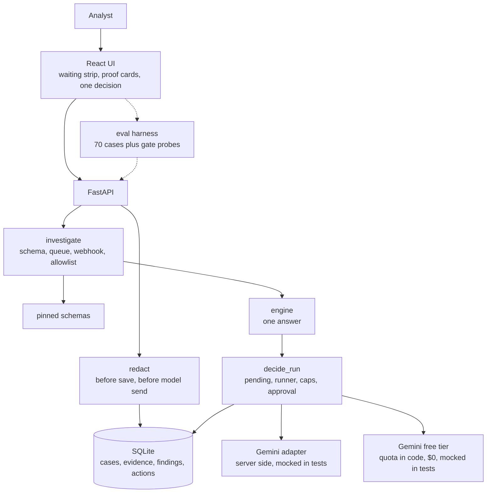

# fal Request Rescue

A support analyst pastes in a broken fal API report. The app checks the payload
against a pinned schema, reads the queue and callback state, and answers one
question. Fix it this way. Ask the customer for one thing. Or send it to
engineering. Nothing runs live and nothing bills anyone unless an analyst
approves it twice, in words on a screen.

## Why this exists

Guessing is how support burns money. A client timeout looks like a dead model.
A failed callback looks like a failed render. Somebody reruns a paid request
that already finished. This tool turns each report into redacted facts, a
schema verdict, a state reading, and one answer with its proof attached. When
the facts do not support an answer, it says what is missing instead of
inventing it.

## How to run it

You need Docker. Nothing else. No keys, no accounts.

```bash
docker compose up -d --build
```

Open http://localhost:8080 for the UI. The API lives at
http://localhost:8000. When you finish, run `docker compose down`.

Live tests run against the Gemini API free tier (no credits).
Put your key in the server environment as `GEMINI_API_KEY` and the app
enforces a daily quota in code. Without a key, or past quota, it tells you
so and stops.

## How to work a case, step by step

1. Open the UI. You see what is waiting, newest worry first, each in plain
   words. Everything here is practice. The frame says so.
2. Open a case. The app already read it and shows its answer at the top.
   Below that, each finding states what it saw, where it saw it, and how
   sure it is.
3. Check the change, if one is proposed. A small table shows each field
   before and after. Option lists show as chips.
4. Answer the one question. Approve the fix, send the evidence request, or
   escalate. The case closes with a line saying where it went.
5. Look further only if you want to. Queue and callback state, the timeline,
   and the engineering export sit behind "show me why" links.
6. Try a replay any time. It reruns the case against its fixture, cites the
   fixture by name, and records the run. Free, always.
7. Touch live traffic only on purpose. A live test needs your approval first,
   then must pass the spend caps and the daily free quota. It runs against a
   free Gemini flash model, so each run costs $0.
   Without a runner it tells you so and stops.

## How to develop it

Backend first, from `backend/`:
```bash
pip install -r requirements.txt
python -m uvicorn app.main:app --port 8000
python -m pytest tests/ -q
```

Then the UI, from `frontend/`:

```bash
bun install
bun run dev   # proxies /cases + /health to :8000
```

Check types with `bunx tsc --noEmit` before you commit.

## How to check it

```bash
python3 eval/generate.py     # rebuild the 60 eval cases (30/10/20)
python3 eval/run_eval.py --split all   # 70 cases + gate probes, must exit 0
```

The bar is four legs. Starter cases green. No secrets anywhere stored or
shown. Nine of ten supported held-out answers right. Spend, status, and runner
gates all fire. Results land in `eval/REPORT.md`.

## What the checks say

Latest full run: 70 cases, every answer matching its gold, 11 of 11 on the
supported held-out set, safety clean, all three gate probes firing. Re-verified
2026-10-01 after a final cleanup pass: backend pytest 68/68 green, eval still
70/70 with the release bar passing. Read that
as a tripwire, not a trophy. The cases are synthetic families, so a green run
means nothing broke, not that the app handles the wild. `eval/LIMITATIONS.md`
says the rest.

## How it fits together



## Where things live

- `backend/app` holds the API, the checks, the answer engine, and the SQLite
  store. Secrets get redacted before anything is saved.
- `frontend/src` holds the analyst screens, built with Bun.
- `schemas/` pins each endpoint format plus pricing. `fixtures/` holds the 10
  gold cases. `eval/` holds the harness and its report.
- `docs/` holds the architecture notes, the data notes, the 3-minute demo
  script, and the cost scenario. Start with `docs/DEMO.md` if someone asks
  what this is for.
